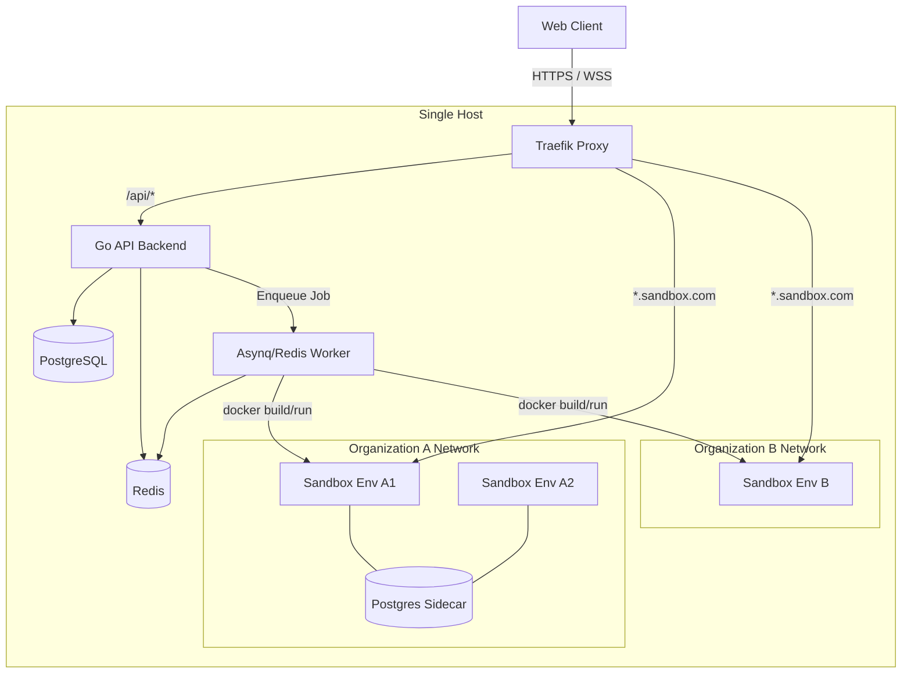
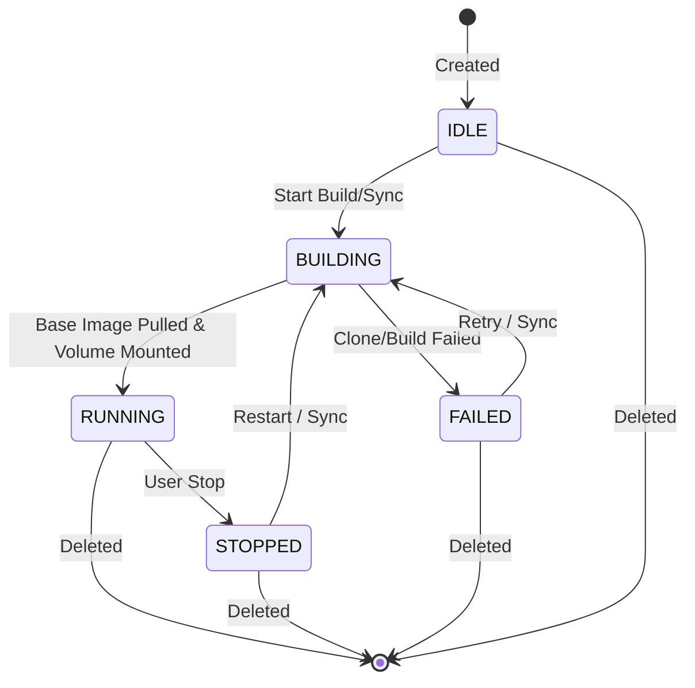

# API Sandbox Architecture

This document describes the design, lifecycle, and security model of the API Sandbox platform.

## System Architecture

The platform operates on a single-host orchestrator model, leveraging Docker and Traefik to isolate and route traffic to user sandboxes.

## Environment Lifecycle

The `Environment` is the single abstraction for both interactive workspaces and live code.

## Trust Boundaries & Security

The system enforces isolation at multiple layers to safely run untrusted code. However, it is critical to understand what these mechanisms protect against and what they do *not* protect against.

| Boundary | Mechanism | What it does *not* protect |
|----------|-----------|----------------------------|
| **API auth** | JWT cookie | Compromised API process |
| **Tenant net** | bridge per org | Host if socket abused |
| **Container** | CapDrop, no-new-priv, mem/PID | Kernel 0-days, socket mount |
| **Paths** | workspace root checks | Host FS via API bug/RCE |

### ⚠️ Critical Limitation: The Docker Socket
The `Backend` and `Worker` containers mount `/var/run/docker.sock` to orchestrate sandboxes. This is equivalent to host-level `root` access. If the Go backend is compromised, the host is compromised. Therefore, this platform is strictly limited to a single dedicated host.

## Editor Strategy: Live Bind-Mount

**Decision**: The web editor provides true live hot-reloading by writing directly to the host filesystem, which is bind-mounted into the ephemeral development sandbox container.

### Context
Unlike traditional immutable PaaS deployments (e.g., using Nixpacks or Heroku Buildpacks), this platform is optimized strictly for **development**. Code is not baked into OCI images. Instead, raw source code is mapped into language-specific alpine runtimes.

### Implementation
- **Live Editor**: When a user hits Save in the browser, the Go backend writes the file to the host's `/var/lib/api-sandbox/workspaces/<env-id>` directory.
- **Bind Mounts**: The sandbox container mounts this host directory as its working directory.
- **Process Watchers**: The container's entrypoint script runs a native process watcher (`node --watch`, `air`, `nodemon`, etc.) which detects the file change over the bind mount and restarts the application instantly.
- **Traefik Retries**: Traefik intercepts traffic during the brief 1-2 second restart window, masking `502 Bad Gateway` errors with a loading state until the container starts accepting connections again.
