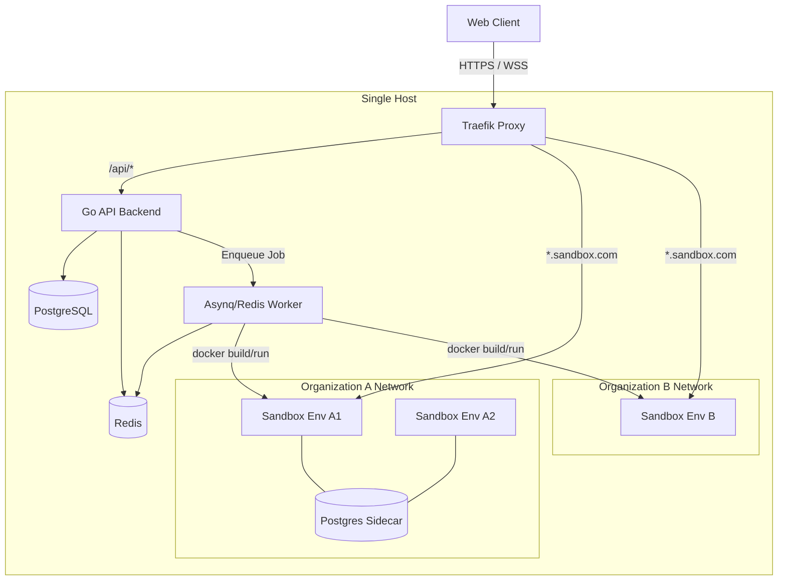
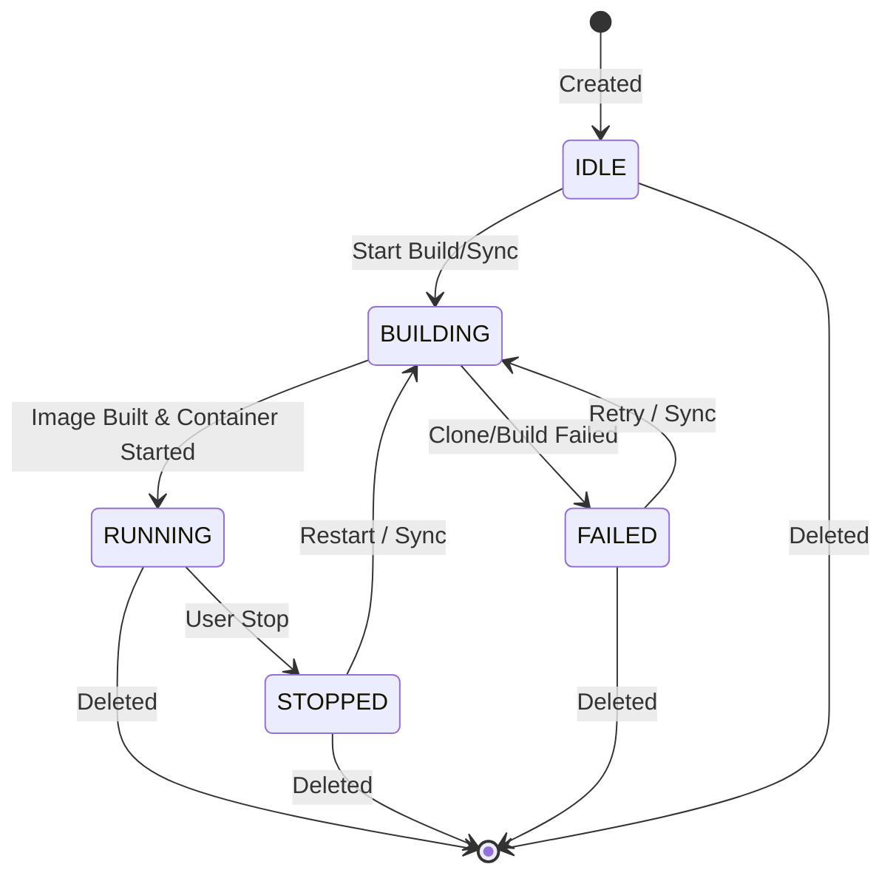

# API Sandbox Architecture

This document describes the design, lifecycle, and security model of the API Sandbox platform.

## System Architecture

The platform operates on a single-host orchestrator model, leveraging Docker and Traefik to isolate and route traffic to user sandboxes.

## Environment Lifecycle

The `Environment` is the single abstraction for both interactive workspaces and live code.

## Trust Boundaries & Security

The system enforces isolation at multiple layers to safely run untrusted code. However, it is critical to understand what these mechanisms protect against and what they do *not* protect against.

| Boundary | Mechanism | What it does *not* protect |
|----------|-----------|----------------------------|
| **API auth** | JWT cookie | Compromised API process |
| **Tenant net** | bridge per org | Host if socket abused |
| **Container** | CapDrop, no-new-priv, mem/PID | Kernel 0-days, socket mount |
| **Paths** | workspace root checks | Host FS via API bug/RCE |

### ⚠️ Critical Limitation: The Docker Socket
The `Backend` and `Worker` containers mount `/var/run/docker.sock` to orchestrate sandboxes. This is equivalent to host-level `root` access. If the Go backend is compromised, the host is compromised. Therefore, this platform is strictly limited to a single dedicated host.

## Editor Strategy: GitHub-First (Non-Live)

**Decision**: The web editor acts as a view/preparation environment. To run new code, users must commit and sync (push) to GitHub, which triggers a rebuild and restart of the sandbox.

### Context
Since the API Sandbox leverages Nixpacks to build immutable OCI Docker images, all dependencies and build steps are baked into the image. Implementing real-time "live" edits via bind-mounting host directories into these containers contradicts the immutable buildpack architecture and introduces significant fragility. 

### Implementation
- **Non-Live Editor**: Edits are local until committed.
- **Workflow**: Edits -> Commit/Push -> Rebuild -> Restart.
- If true live-reloading is required in the future, it should be built as a separate "Dev Mode" rather than compromising the current robust Nixpacks workflow.
