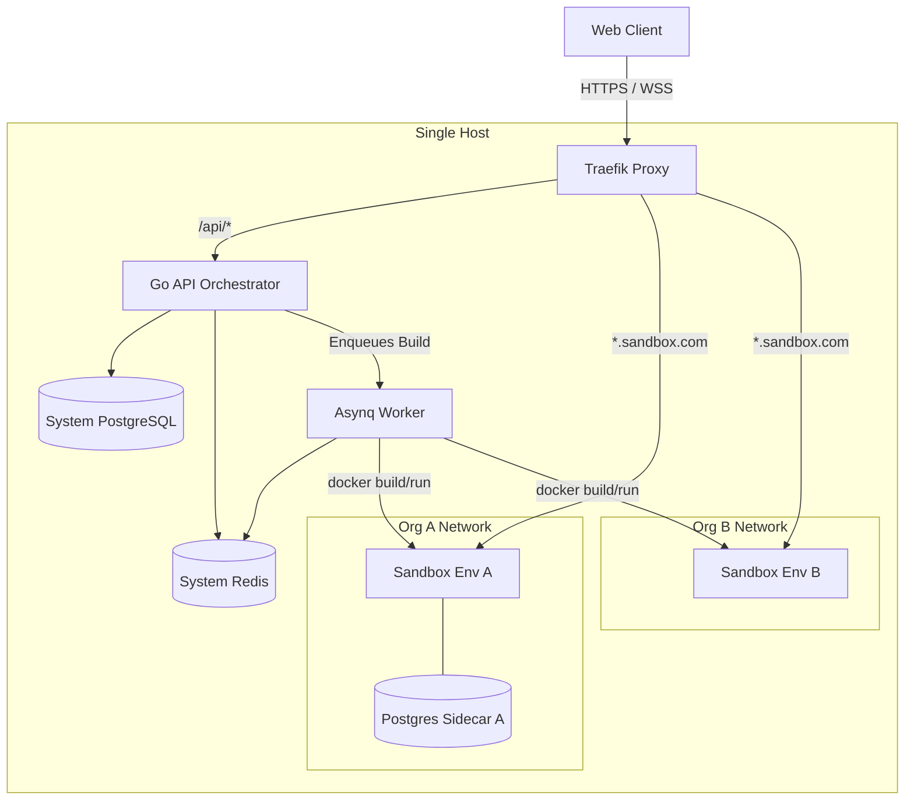

# API Sandbox Architecture

This document outlines the high-level architecture of the API Sandbox platform, specifically focusing on the orchestrator, proxy routing, and the real-time development loop.

## System Topology

The platform operates on a single dedicated host machine utilizing Docker and Traefik to orchestrate, isolate, and route traffic to user sandboxes dynamically.

## The Real-Time Development Loop

The absolute core technical requirement of this platform is the **Real-Time Dev Loop**—ensuring that a user saving a file in the browser experiences the result of that code change in under 2 seconds.

### Bind-Mount Synchronization
Unlike traditional CI/CD pipelines that rebuild immutable OCI images, this platform maps raw source code directly into language-specific Alpine runtimes via host-level bind mounts.
1. The Go backend receives the edited file content via the `POST /api/environments/:id/files/content` endpoint.
2. The file is written synchronously to the host path: `/var/lib/api-sandbox/workspaces/<env-id>`.
3. The host path is bind-mounted directly to `/app` inside the ephemeral sandbox container.

### Fast Process Watchers
We rely entirely on native process watchers to handle the reboot inside the container without terminating PID 1:
- **Node.js**: Uses `npx nodemon` to survive rapid I/O spikes without crashing.
- **Python**: Uses `uvicorn --reload --reload-dir .`.
- **Go**: Uses `air` (specifically pinned to `v1.52.3` to ensure compatibility with `golang:alpine`).

### HTTP Proxy Readiness Polling
Once the file is saved, the container begins its reboot. The Go backend must actively determine *exactly when* the application is ready to accept traffic again. 

Initially, we used raw TCP dials against the container's internal IP. This failed due to strict Docker network isolation (Organization networks vs. Backend network). We migrated to a robust **HTTP Proxy Routing** strategy:
1. The Go backend polls the Traefik entrypoint using an HTTP GET request with a forged `Host` header (e.g., `Host: {env-id}.localhost`).
2. Traefik routes the request into the isolated container network.
3. If the container is still rebooting, Traefik immediately returns `502 Bad Gateway`. 
4. The Go backend iteratively polls every few milliseconds until it receives a `200 OK` (or any non-502 status), definitively proving the application is ready.

This proxy-first polling mechanism entirely eliminates network boundary issues and accurately simulates a user's browser, enabling us to achieve consistent `p95 < 1s` latency.
