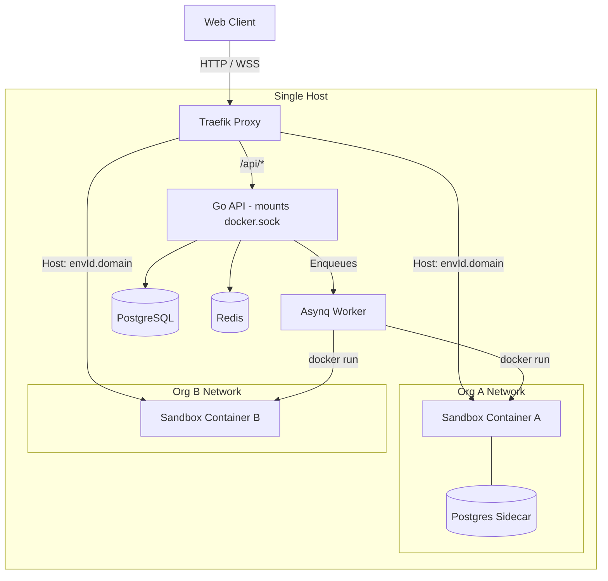
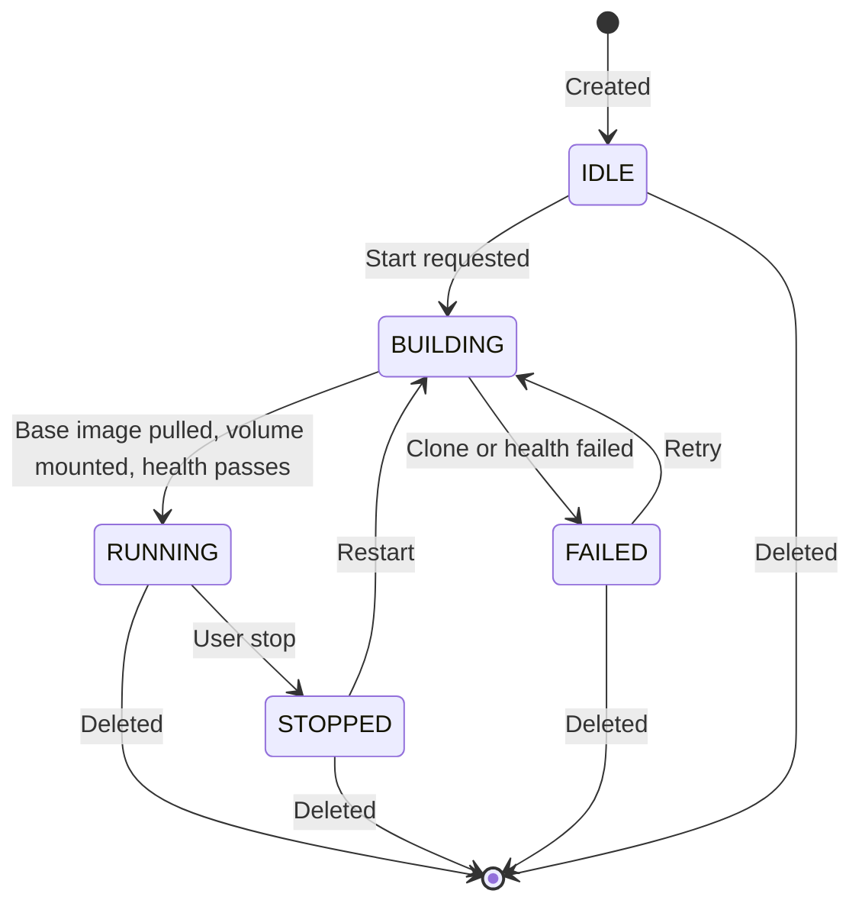

# Architecture

This document describes the design, lifecycle, and trust boundaries of the API Sandbox.

## What It Is

A single-host orchestrator. One Linux machine runs Docker, Traefik, a Go backend, a Next.js frontend, PostgreSQL, and Redis. The backend uses the Docker socket to provision ephemeral user sandbox containers on that same host.

## System Diagram

## Environment Lifecycle

The environment is the primary abstraction. Lifecycle state:

**"RUNNING" means:** base image is pulled, code directory is bind-mounted to `/app`, a process watcher is running inside the container, and the TCP/HTTP health check has returned success. It does not mean the application is fully built or ready — just that the container process started.

## How the Dev Loop Works

1. User saves a file in the browser IDE
2. Go backend writes the file to the host path `/var/lib/api-sandbox/workspaces/<env-id>/`
3. The sandbox container has this directory bind-mounted to `/app`
4. The process watcher inside the container detects the change and restarts the application
5. The backend polls Traefik with the environment's virtual host header until it receives a non-502 response
6. A `reload_ready` WebSocket event is broadcast to all connected clients

Warm reload latency (Node.js): ~250ms. Cold starts are substantially longer.

## Trust Boundaries

| Boundary | Mechanism | What it does not protect |
|----------|-----------|--------------------------|
| API auth | JWT cookie | Compromised API process |
| Tenant network | Bridge per org | Host if socket is abused |
| Container | CapDrop, no-new-privs, mem/PID limits | Kernel exploits, socket mount |
| Path validation | Workspace root checks | Host FS via RCE in Go backend |

## Critical Limitation: Docker Socket

The Backend container mounts `/var/run/docker.sock`. This is functionally equivalent to host root access. If the Go backend is exploited, the attacker controls the host.

**This is a deliberate design tradeoff for a single-host, trusted-user tool.** Do not use this as a multi-tenant public platform.

## Editor Strategy

Code is **not** baked into images. Raw source is mapped from the host into Alpine-based language runtimes via bind mounts. This enables live editing but means the container and host share the same codebase at all times.

Process watchers per runtime:
- **Node.js**: `npx nodemon`
- **Python**: `uvicorn --reload --reload-dir .`
- **Go**: `air` (pinned to v1.52.3, compatible with `golang:alpine`)
