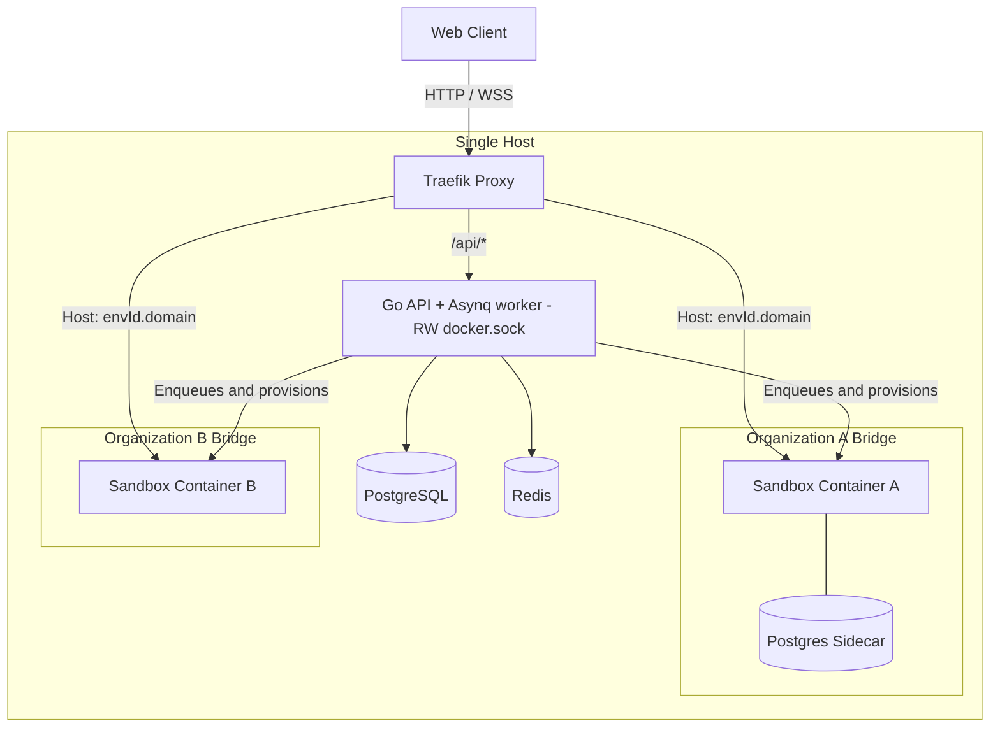
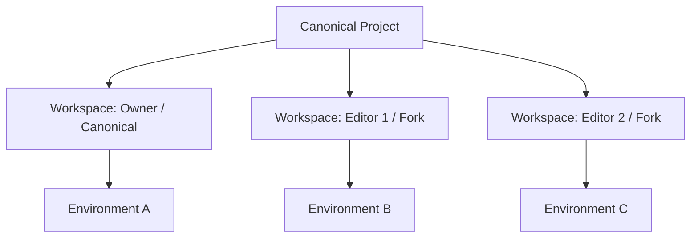
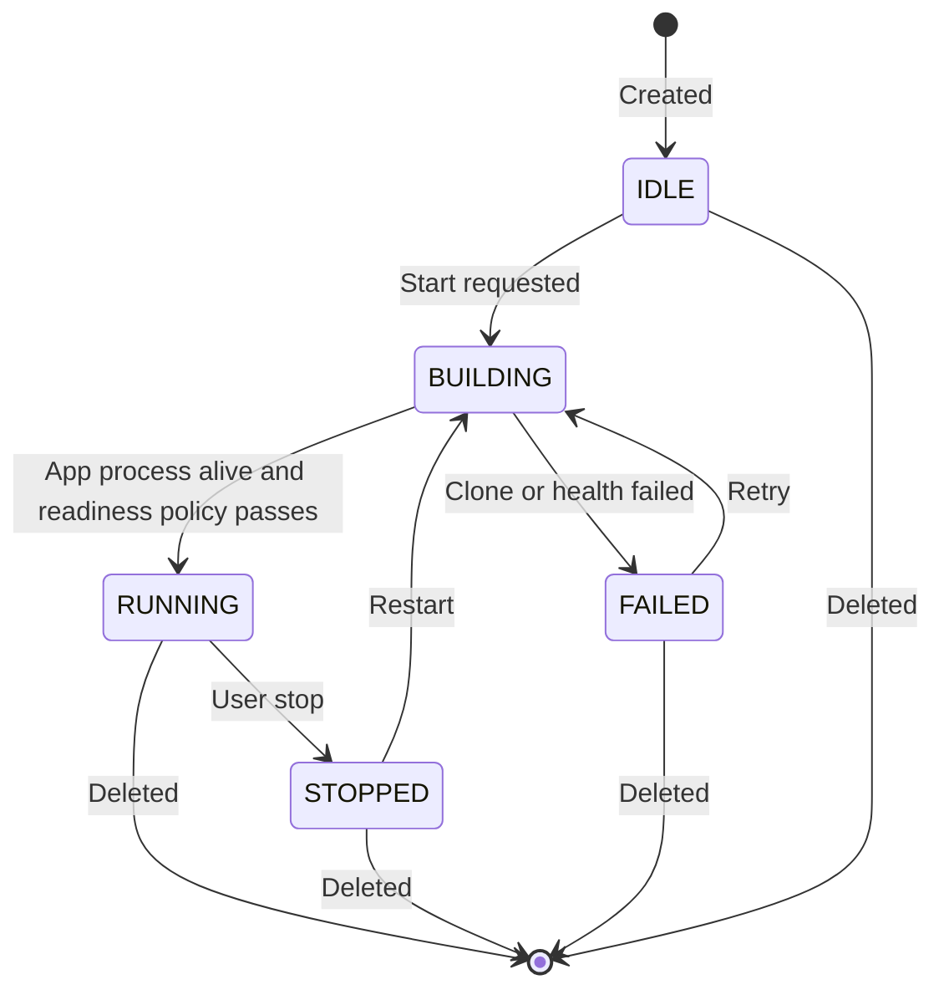

# Architecture

This document describes the design, lifecycle, and trust boundaries of the API Sandbox.

## What It Is

A single-host orchestrator. One Linux machine runs Docker, Traefik, a Go backend/Asynq worker, a Next.js frontend, PostgreSQL, and Redis. The backend process and worker run in the same service and use the Docker socket to provision ephemeral runtime containers.

## System Diagram

```mermaid
graph TD
    Client[Web Client]
    subgraph Single Host
        Traefik[Traefik Proxy]
        Backend[Go API + Asynq worker - RW docker.sock]
        PostgreSQL[(PostgreSQL)]
        Redis[(Redis)]

        subgraph Organization A Bridge
            EnvA[Sandbox Container A]
            DB_A[(Postgres Sidecar)]
            EnvA --- DB_A
        end

        subgraph Organization B Bridge
            EnvB[Sandbox Container B]
        end
    end

    Client -->|HTTP / WSS| Traefik
    Traefik -->|/api/*| Backend
    Traefik -->|Host: envId.domain| EnvA
    Traefik -->|Host: envId.domain| EnvB

    Backend --> PostgreSQL
    Backend --> Redis
    Backend -->|Enqueues and provisions| EnvA
    Backend -->|Enqueues and provisions| EnvB
```

## Project and Workspace Hierarchy

The fundamental architecture uses a hierarchical approach:

```mermaid
graph TD
    Project[Canonical Project]
    WorkspaceA[Workspace: Owner / Canonical]
    WorkspaceB[Workspace: Editor 1 / Fork]
    WorkspaceC[Workspace: Editor 2 / Fork]
    EnvA[Environment A]
    EnvB[Environment B]
    EnvC[Environment C]

    Project --> WorkspaceA
    Project --> WorkspaceB
    Project --> WorkspaceC
    WorkspaceA --> EnvA
    WorkspaceB --> EnvB
    WorkspaceC --> EnvC
```

*   **Project**: Represents the overarching logical application, managing members and settings.
*   **Workspace**: Represents an isolated git working tree. `OWNER` modifies the canonical workspace. Each `EDITOR` receives a unique isolated `FORK` workspace.
*   **Environment**: The actual running Docker container connected to a Workspace.

## Environment Lifecycle

The environment is the container abstraction attached to a Workspace. Lifecycle state:

```mermaid
stateDiagram-v2
    [*] --> IDLE : Created
    IDLE --> BUILDING : Start requested
    BUILDING --> RUNNING : App process alive and readiness policy passes
    BUILDING --> FAILED : Clone or health failed
    RUNNING --> STOPPED : User stop
    STOPPED --> BUILDING : Restart
    FAILED --> BUILDING : Retry
    RUNNING --> [*] : Deleted
    STOPPED --> [*] : Deleted
    FAILED --> [*] : Deleted
    IDLE --> [*] : Deleted
```

**"RUNNING" means:** the runtime container is alive and the configured readiness policy passed. For the legacy `tcp` value, that means the preview route returned 2xx. For `none`, only a live process is required. It does not guarantee continued availability: if PID 1 exits later, Docker stops the container and the one-minute reaper marks the environment failed.

Every provisioning attempt creates a fresh runtime container. The warm pool pulls and records image references only; it does not hand a running container to an environment. The worker attaches the runtime to its user-scoped bridge and assigns its environment-specific writable mounts.

### Runtime mounts and limits

| Host source | Runtime destination | Mode | Purpose |
|---|---|---|---|
| `${HOST_WORKSPACES_DIR}/<environment-id>` | `/app` | Read/write | That environment's source tree |
| `${HOST_WORKSPACES_DIR}/.cache/<environment-id>/npm` | `/root/.npm` | Read/write | npm cache |
| `${HOST_WORKSPACES_DIR}/.cache/<environment-id>/pnpm` | `/root/.local/share/pnpm/store` | Read/write | pnpm cache |
| `${HOST_WORKSPACES_DIR}/.cache/<environment-id>/pip` | `/root/.cache/pip` | Read/write | pip cache |
| `${HOST_WORKSPACES_DIR}/.cache/<environment-id>/go` | `/go/pkg/mod` | Read/write | Go module cache |

The runtime does not mount the shared `${HOST_WORKSPACES_DIR}` root at `/workspaces`, and does not receive a Docker socket. The trusted backend separately mounts the workspace root at `/app/workspaces` to manage files.

Runtime image defaults currently run as UID 0. Application startup scripts install dependencies and then `exec` the configured start command under the container's PID 1 shell. There is no `sleep infinity` parent, detached app exec, or Docker restart policy. Thus an app process exit stops the runtime container. The actual Docker configuration sets 512 MiB memory and memory+swap, one CPU using `CPUQuota=100000` and `CPUPeriod=100000`, and a 256 PID limit. It drops all Linux capabilities and enables `no-new-privileges`; it does not use privileged mode, host PID/network/IPC namespaces, or device mappings. Non-root compatibility has not been established for arbitrary projects, especially install commands that need root.

### Docker networks

Compose infrastructure services (backend, PostgreSQL, Redis, Traefik, frontend) share `traefik-net`. Runtime containers use `api-sandbox-net-<user-id>` and are not attached to `traefik-net`. All environments and database sidecars for the same user share that bridge; different users use different bridges. Traefik is attached to each user bridge for routing. Local Docker verification confirmed outbound HTTP works; bounded probes to host gateway port 80 and shared Redis failed. Internet egress remains enabled for Git/repository access and dependency downloads.

### Startup and readiness

`healthCheckType: "http"` is the default for web runtimes: the worker requests the preview root and requires a final 2xx response. Redirects are not followed; 3xx, 4xx, and 5xx responses do not qualify. `healthCheckType: "tcp"` checks a TCP connection to the runtime container's configured port. `healthCheckType: "none"` skips both probes but still requires the runtime container to remain running. The worker checks process liveness while waiting, with a 10-minute timeout per runtime candidate. A build task is bounded to 45 minutes.

## How the Dev Loop Works

1. User saves a file in the browser IDE
2. Go backend writes the file to the host path `/var/lib/api-sandbox/workspaces/<env-id>/`
3. The sandbox container has this directory bind-mounted to `/app`
4. The process watcher inside the container detects the change and restarts the application
5. The worker polls Traefik with the environment's virtual host header until it receives a 2xx response
6. A `reload_ready` WebSocket event is broadcast to all connected clients

Warm reload latency (Node.js): ~250ms. Cold starts are substantially longer.

## Trust Boundaries

| Boundary | Mechanism | What it does not protect |
|----------|-----------|--------------------------|
| API auth | JWT cookie | Compromised API process |
| Tenant network | Bridge per user | Same-user environments can communicate; host if socket is abused; outbound egress is allowed |
| Container | CapDrop, no-new-privs, mem/PID limits | Kernel exploits, socket mount |
| Path validation | Workspace root checks | Host FS via RCE in Go backend |

## Critical Limitation: Docker Socket

The backend/worker container mounts `/var/run/docker.sock` read/write. It uses Docker operations for image pulls, container create/start/stop/remove/inspect/exec/logs, and network list/create/inspect/connect. This is functionally equivalent to host-root authority. The API handler and worker are in the same backend service, so the current deployment does not grant them separate socket capabilities.

Traefik uses Docker provider discovery to read Compose labels and discover backend/frontend routes; the socket is mounted with `:ro`. That protects the socket path from filesystem writes only; it does not make Docker API access read-only. Removing Docker discovery would require replacing the current dynamic label-based routing configuration. Runtime containers have no socket mount.

| Component | Socket mount | Why / operations | Can it be removed in the current design? |
|---|---|---|---|
| Backend + worker | Read/write | Pulls images; creates, starts, inspects, execs, logs, stops, restarts, and removes containers; creates/lists/connects/inspects networks | No, not while this process provisions and supervises runtime containers directly |
| Traefik (production and dev Compose) | `:ro` filesystem mount | Docker provider discovers labeled Compose services and their endpoints | Not without replacing Docker provider discovery and current label-driven routing |
| Runtime containers | None | User project execution has no Docker control-plane need | No socket is required |
| Frontend, PostgreSQL, Redis | None | No Docker control-plane operations | No socket is required |

The Go API handlers and Asynq worker share the backend service, so they cannot have separate socket permissions in the current deployment. A socket mount with `:ro` is not an API authorization boundary. The Docker socket is not passed to tests/scripts as a container mount; the real-Docker test commands run from the developer/CI process that invokes the Docker CLI or Go client.

**This is a deliberate design tradeoff for a single-host, trusted-user tool.** Do not use this as a multi-tenant public platform. Runtime preview must return 2xx to pass boot readiness. Preview routes are stored as individual Redis KV paths for Traefik's Redis provider; the prior hash-shaped Redis entries did not load and returned 404. The corrected route format passed the live Compose preview check.

## Editor Strategy

Code is **not** baked into images. Raw source is mapped from the host into Alpine-based language runtimes via bind mounts. This enables live editing but means the container and host share the same codebase at all times.

Process watchers per runtime:
- **Node.js**: `npx nodemon`
- **Python**: `uvicorn --reload --reload-dir .`
- **Go**: `air` (pinned to v1.52.3, compatible with `golang:alpine`)
